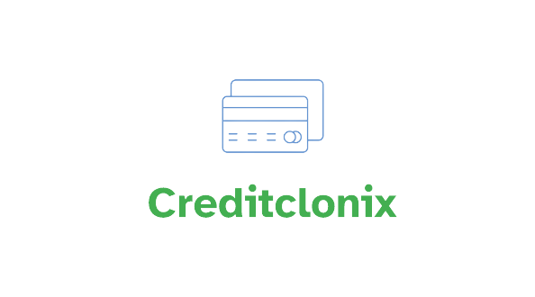

   

<h3>SOBRE O PROJETO</h3>

  "Creditclonix" é um projeto que eu criei para treinar minhas habilidades em HTML e CSS puro. O objetivo desse     projeto é aprimorar meu conhecimento nessas linguagens de marcação e praticar a criação de uma página de         crédito   fictícia. Não se trata de um projeto real, mas sim de um projeto pessoal de aprendizado.
   
  
  * Para acessar o deploy do projeto, <a href="https://jams35.github.io/Creditclonix/">clique aqui.</a>

<h3>TECNOLOGIAS USADAS</h3>

  
  

